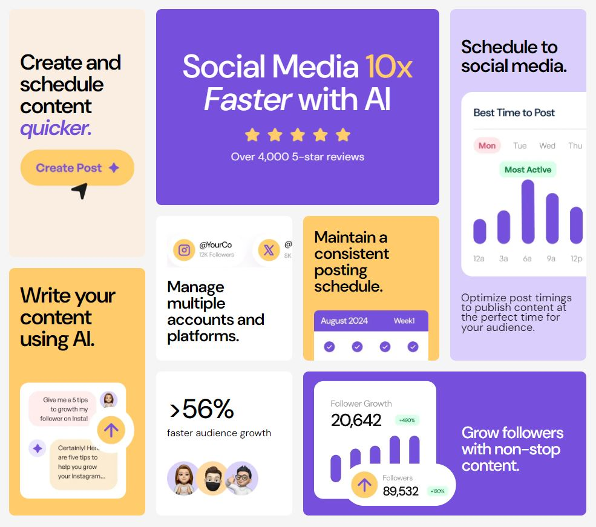

# Frontend Mentor - Bento grid solution

This is a solution to the [Bento grid challenge on Frontend Mentor](https://www.frontendmentor.io/challenges/bento-grid-RMydElrlOj). Frontend Mentor challenges help you improve your coding skills by building realistic projects.

## Table of contents

- [Overview](#overview)
  - [The challenge](#the-challenge)
  - [Screenshot](#screenshot)
- [My process](#my-process)
  - [Built with](#built-with)
  - [What I learned](#what-i-learned)
- [Author](#author)

**Note: Delete this note and update the table of contents based on what sections you keep.**

## Overview

### The challenge

Users should be able to:

- View the optimal layout for the interface depending on their device's screen size

### Screenshot

## My process

### Built with

- Semantic HTML5 markup
- CSS custom properties
- Flexbox
- CSS Grid Template
- Mobile-first workflow

### What I learned

This was a hard one. The Bento box layout for the desktop version is a pain to set up unless you know about the grid template functionality. I'm sure there's a way to do this without using that option but I could not find it. Other than that, there is also the problem of images that overflow in a specific direction which took me a while. I learned a lot about flex and grid layouts through this challenge.

### Useful resources

- [Youtube Video - Bento Grid | Frontend Mentor Challenge (HTML & CSS)](https://www.youtube.com/watch?v=-muwduB2G1A) - A video where the author solves this challenge. This is where I found out about grid-template-areas and used it similarly to the author

## Author

- Frontend Mentor - [@filipangel](https://www.frontendmentor.io/profile/filipangel)
